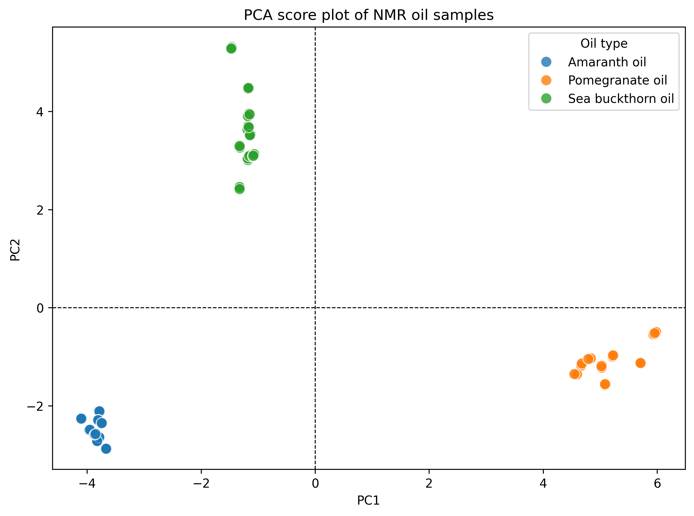
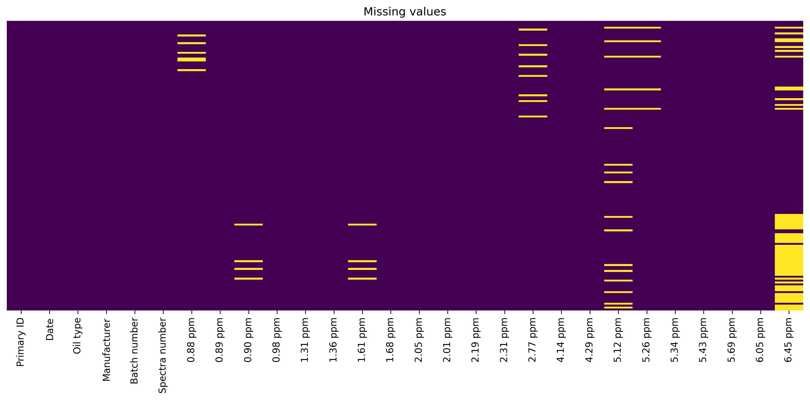
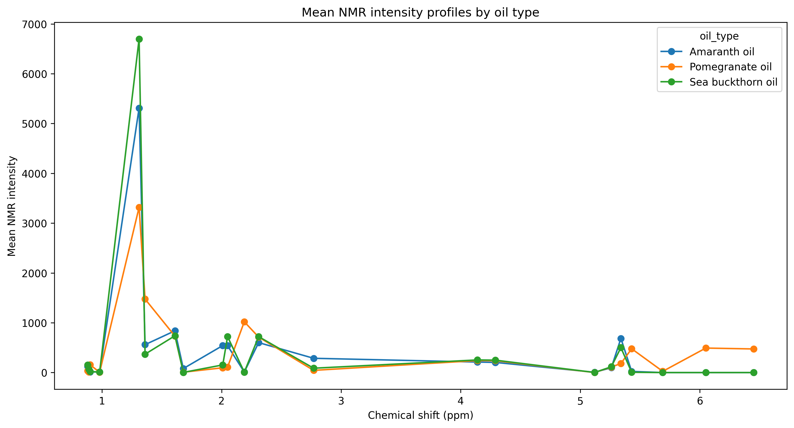
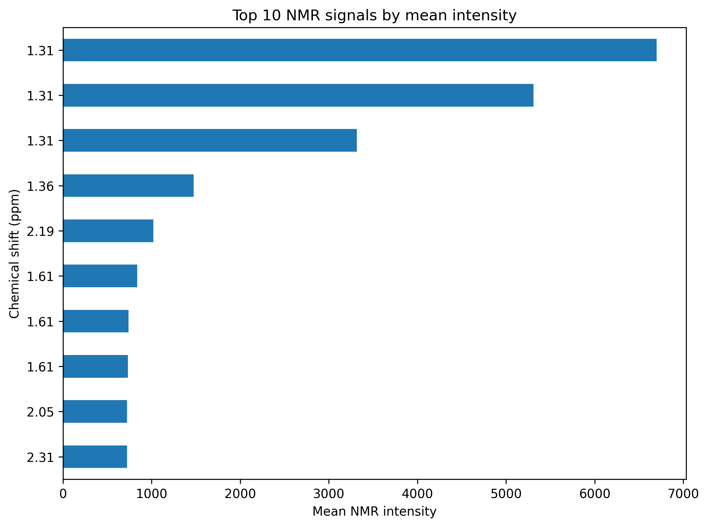
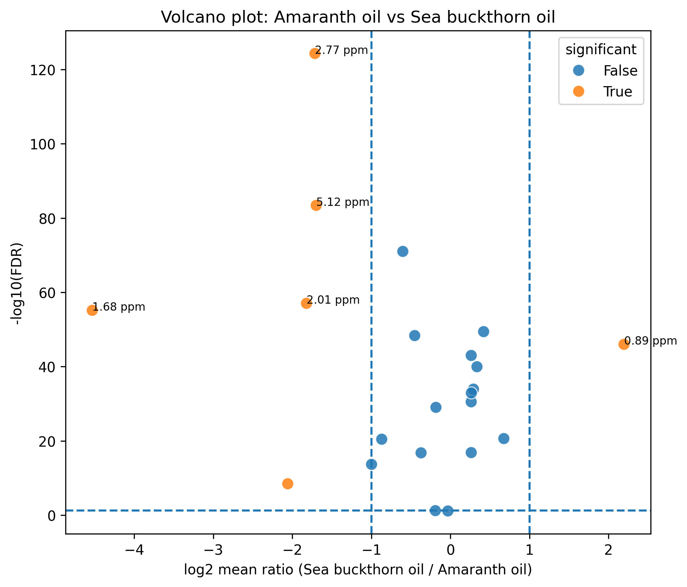
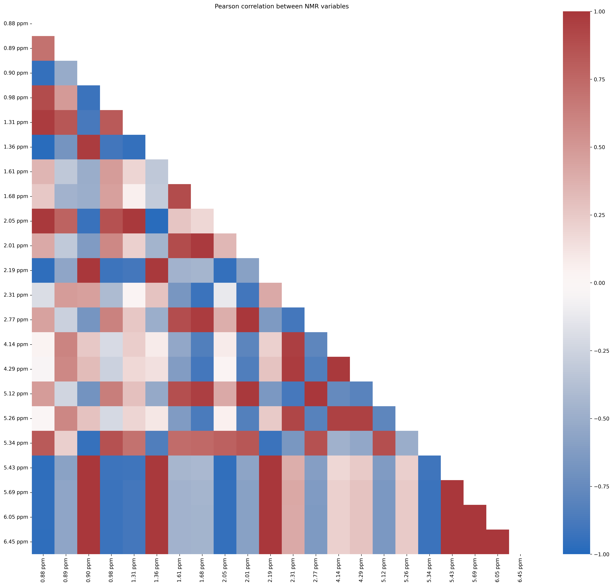
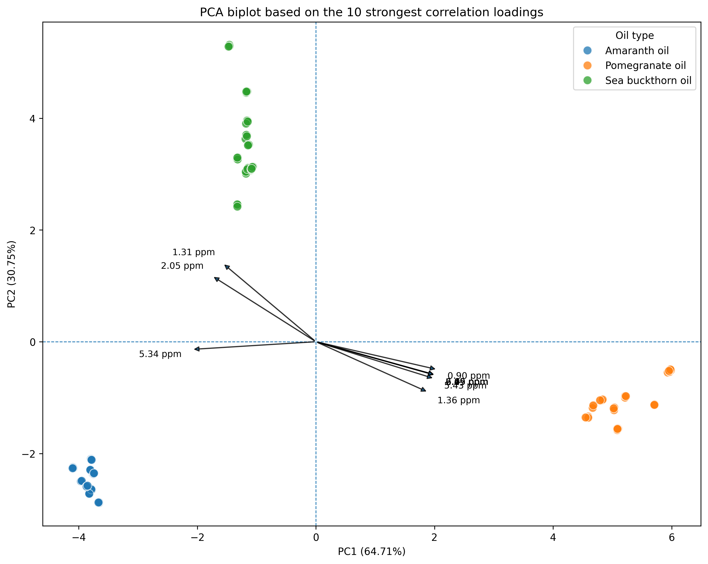
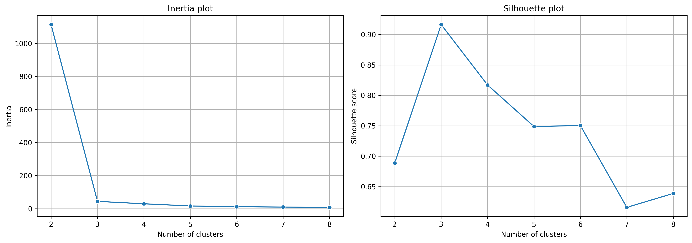
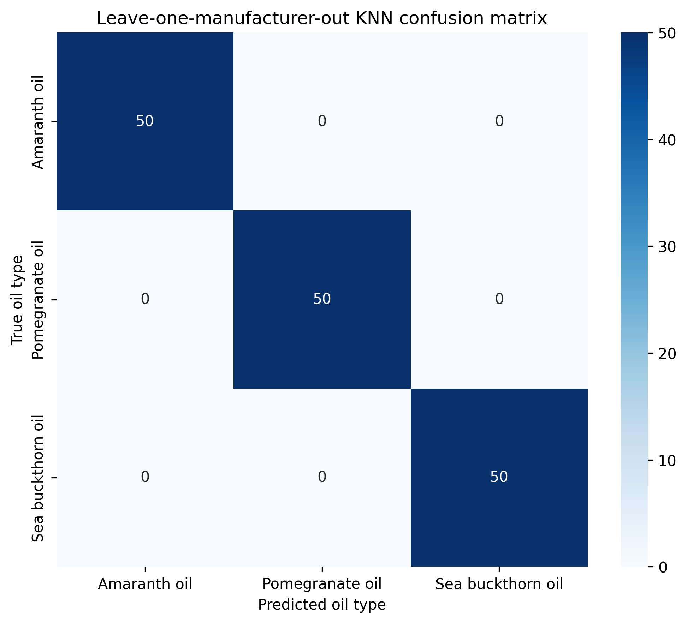

# NMR Analysis of Edible Oils

This project presents a reproducible workflow for preparing, storing and analysing NMR measurements from three oil types:

- amaranth oil,
- pomegranate oil,
- sea buckthorn oil.

The project combines data cleaning, missing-value imputation, relational database design, SQL analytics, statistical testing, principal component analysis, clustering and supervised classification.

<p align="center">
  
</p>

## Dataset

The NMR dataset was provided by the course instructor for educational purposes. The original experimental source were not supplied.

### Dataset at a glance

| Property | Value |
|---|---:|
| Raw records | 150 |
| Processed records | 149 |
| NMR variables | 22 |
| Oil types | 3 |
| Manufacturers | 4 |
| Raw missing NMR values | 98 |
| Normalized SQL measurement rows | 3,278 |

One duplicated analytical profile was removed during preparation. The processed dataset contains 50 amaranth-oil samples, 49 pomegranate-oil samples and 50 sea-buckthorn-oil samples.

## Project objectives

- inspect and clean the raw NMR dataset,
- identify duplicate analytical records and missing values,
- compare imputation approaches and prepare a complete dataset,
- convert the wide NMR table into a normalized relational structure,
- execute SQL queries stored in a separate `.sql` file,
- identify NMR variables that differ among oil types,
- examine correlations between signals,
- reduce dimensionality with PCA,
- evaluate unsupervised grouping with K-means,
- test whether oil type can be predicted for manufacturers excluded from model training.

## Repository structure

```text
nmr-oils-analysis/
├── data/
│   ├── raw/
│   │   └── oils_nmr.csv
│   └── processed/
│       └── oils_processed.csv
├── notebooks/
│   ├── 01_data_preparation.ipynb
│   ├── 02_sql_analysis.ipynb
│   └── 03_multivariate_analysis.ipynb
├── sql/
│   └── oils_analysis.sql
├── diagrams/
│   ├── 01/
│   ├── 02/
│   └── 03/
├── .env.example
├── .gitignore
└── README.md
```

## Workflow

```text
Raw NMR CSV
     │
     ▼
01_data_preparation.ipynb
     │
     ├── duplicate and missing-value analysis
     ├── imputation
     └── oils_processed.csv
     │
     ├──────────────────────────────┐
     ▼                              ▼
02_sql_analysis.ipynb        03_multivariate_analysis.ipynb
     │                              │
     ├── MySQL tables               ├── statistical screening
     ├── external SQL queries       ├── volcano plots
     ├── joins and aggregations     ├── correlation analysis
     ├── CTEs and ranking           ├── PCA and K-means
     └── SQL visualizations         └── KNN classification
```

## Technologies

- Python
- JupyterLab
- Pandas and NumPy
- SciPy and statsmodels
- Matplotlib and Seaborn
- scikit-learn
- MySQL
- SQL

---

## 1. Data preparation

Notebook: [`01_data_preparation.ipynb`](notebooks/01_data_preparation.ipynb)

The first notebook inspects the structure and metadata of the raw dataset, checks analytical records for duplication and evaluates missing NMR values. Seven NMR columns contain missing observations, with the largest number occurring at `6.45 ppm`.

The notebook compares several imputation approaches and uses `KNNImputer` to produce the final complete NMR matrix. Dates are standardized to `YYYY-MM-DD`, batch identifiers are stored consistently, and the final dataset is validated before export to `data/processed/oils_processed.csv`.

### Missing-value pattern

<p align="center">
  
</p>

The missing values are concentrated in selected NMR variables rather than distributed uniformly across the full dataset. The processed file contains no missing NMR intensities.

---

## 2. SQL analysis with MySQL

Notebook: [`02_sql_analysis.ipynb`](notebooks/02_sql_analysis.ipynb)  
Queries: [`oils_analysis.sql`](sql/oils_analysis.sql)

The processed wide table is reshaped into two normalized relational tables:

- `samples`, containing sample metadata,
- `nmr_measurements`, containing one chemical shift and intensity per row.

The database contains 149 sample records and 3,278 NMR measurement records. The tables are linked through `sample_id`, with primary keys, a foreign-key constraint and indexes on sample IDs and chemical shifts.

The external SQL file demonstrates:

- `JOIN`,
- `GROUP BY`,
- `COUNT`, `AVG`, `MIN` and `MAX`,
- common table expressions,
- `CASE`,
- window functions and signal ranking.

### Mean NMR profiles and SQL signal ranking

<p align="center">
  
  
</p>

The SQL summaries show clear differences in mean intensity profiles between the three oil types. The `1.31 ppm` signal has the largest mean intensity within each group, reaching approximately 6,697 for sea buckthorn oil, 5,309 for amaranth oil and 3,317 for pomegranate oil.

---

## 3. Statistical and multivariate analysis

Notebook: [`03_multivariate_analysis.ipynb`](notebooks/03_multivariate_analysis.ipynb)

### Statistical screening

A Kruskal–Wallis test is applied to every NMR variable, followed by Benjamini–Hochberg FDR correction. The highest-ranked variables include `5.12 ppm`, `2.77 ppm`, `0.89 ppm`, `1.68 ppm` and `0.88 ppm`, all showing strong differences among the three oil groups in this dataset.

Pairwise volcano plots combine Welch’s t-test, FDR correction and a log2 mean-ratio threshold.

### Representative volcano plot

<p align="center">
  
</p>

For amaranth oil versus sea buckthorn oil, the largest significant differences include signals at `2.77 ppm`, `5.12 ppm`, `2.01 ppm`, `1.68 ppm`, `0.89 ppm` and `5.43 ppm`.

### Correlation structure

<p align="center">
  
</p>

Several NMR variables are strongly correlated, showing that parts of the spectral information are redundant. For example, within amaranth oil, correlations above 0.95 occur for several signal pairs.

### Principal component analysis

The NMR variables are standardized before PCA.

| Component | Explained variance |
|---|---:|
| PC1 | 64.71% |
| PC2 | 30.75% |
| PC1 + PC2 | 95.46% |
| PC1–PC3 cumulative | 98.54% |

PC1 and PC2 retain most of the variation and provide clearer class separation than the PC1–PC3 combination.

<p align="center">
  
  
</p>

The score plot separates the three oil types into distinct regions. The biplot links this separation to influential signals, including `5.34 ppm`, `0.90 ppm`, `6.05 ppm`, `6.45 ppm`, `2.19 ppm`, `5.69 ppm`, `5.43 ppm`, `1.36 ppm` and `0.88 ppm`.

### K-means clustering

K-means is evaluated for two to eight clusters. The strongest silhouette score is obtained for three clusters.

<p align="center">
  
</p>

For `k = 3`:

- silhouette score: **0.916**,
- adjusted Rand index: **1.000**.

Each cluster corresponds exactly to one oil type in the processed dataset: 50 amaranth-oil samples, 49 pomegranate-oil samples and 50 sea-buckthorn-oil samples.

### KNN classification

KNN classification is evaluated with leave-one-manufacturer-out validation. In each outer fold, one manufacturer is used exclusively as the test group. Missing-value imputation, scaling, PCA-loading-based feature selection and parameter tuning are performed without access to that held-out manufacturer.

<p align="center">
  
</p>

All 150 raw samples were classified correctly across the four held-out manufacturers. The same result was obtained using:

- all 22 signals,
- the top five PCA-loading signals,
- the top three signals,
- the top two signals,
- the strongest single signal,
- all signals except the strongest signal.

The signal at `0.89 ppm` was selected as the strongest training signal in every outer fold. This suggests that the three oil groups are very strongly separated in the supplied dataset and that class information is present in multiple correlated variables.

The perfect score is dataset-specific. It should not be interpreted as evidence of universal performance for other oils, laboratories, acquisition settings or independently collected samples.

---

## Key findings

- One duplicated analytical profile was removed, leaving 149 processed samples.
- Missing observations occurred in seven of the 22 NMR variables and were completed with KNN imputation.
- SQL normalization produced 149 sample rows and 3,278 measurement rows.
- Pairwise and global statistical tests identified strong differences between oil types.
- PC1 and PC2 explained 95.46% of total variance and clearly separated the three groups.
- Three-cluster K-means achieved a silhouette score of 0.916 and an adjusted Rand index of 1.000.
- Leave-one-manufacturer-out KNN classification achieved 100% accuracy within this dataset, even with reduced feature sets.

## Limitations

- The original source and experimental acquisition details were not provided.
- The dataset contains only three oil types and four manufacturers.
- The samples are strongly separated, which makes classification comparatively easy.
- Imputed values are estimates and should not be treated as direct measurements.
- Results require confirmation using independently collected NMR data before practical deployment or chemical interpretation.

## MySQL setup

The SQL notebook uses a local MySQL Server. The server must be installed and running separately from JupyterLab.

Create the project database and a local user, then copy `.env.example` to `.env`.

Example configuration:

```env
MYSQL_HOST=127.0.0.1
MYSQL_PORT=3306
MYSQL_USER=oils_user
MYSQL_PASSWORD=your_password
MYSQL_DATABASE=oils_nmr
```

Do not commit `.env` to the repository.

## Running the project

Run the notebooks in this order:

```text
01_data_preparation.ipynb
        ↓
02_sql_analysis.ipynb
        ↓
03_multivariate_analysis.ipynb
```

Suggested Python packages:

```bash
pip install pandas numpy scipy statsmodels matplotlib seaborn scikit-learn \
            mysql-connector-python python-dotenv jupyterlab
```

Start JupyterLab:

```bash
jupyter lab
```

## Reproducibility notes

- The processed CSV is generated by notebook 01.
- Notebook 02 rebuilds the normalized MySQL tables and loads the processed data.
- Analytical queries are stored separately in `sql/oils_analysis.sql`.
- Notebook 03 uses the processed data for exploratory multivariate analysis.
- The KNN section reloads the raw data so that imputation can be fitted separately inside each validation fold.

## License

This repository was created for educational and portfolio purposes.

