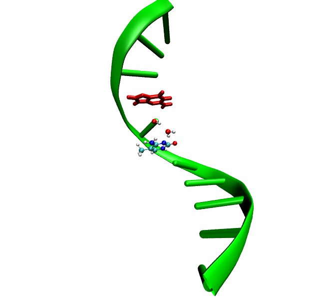
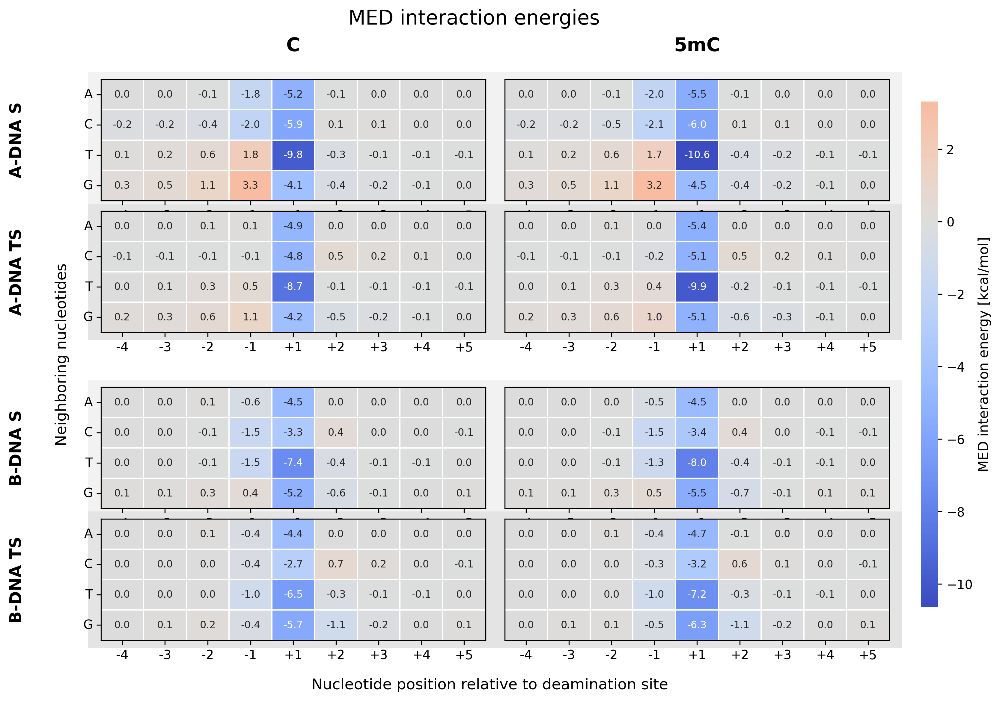
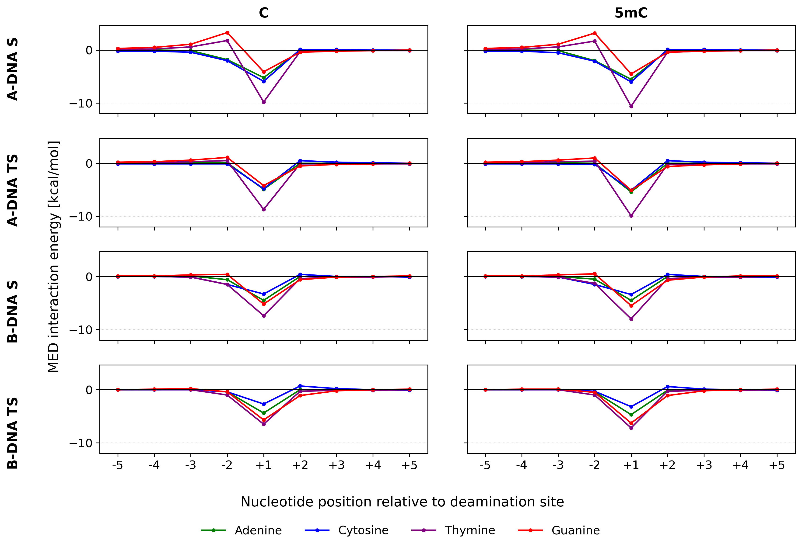
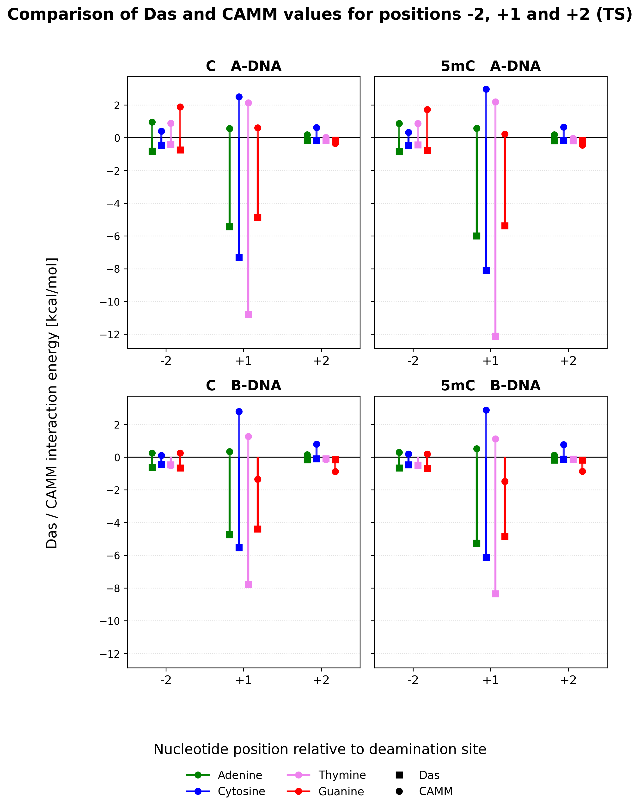
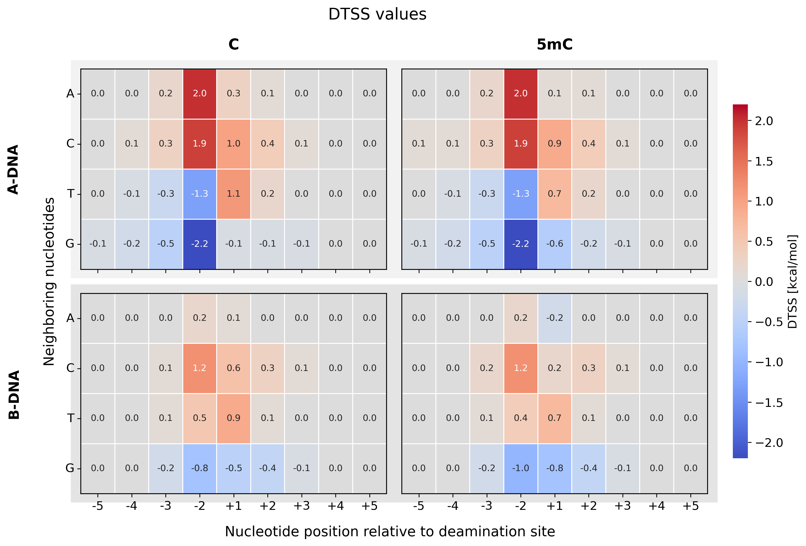
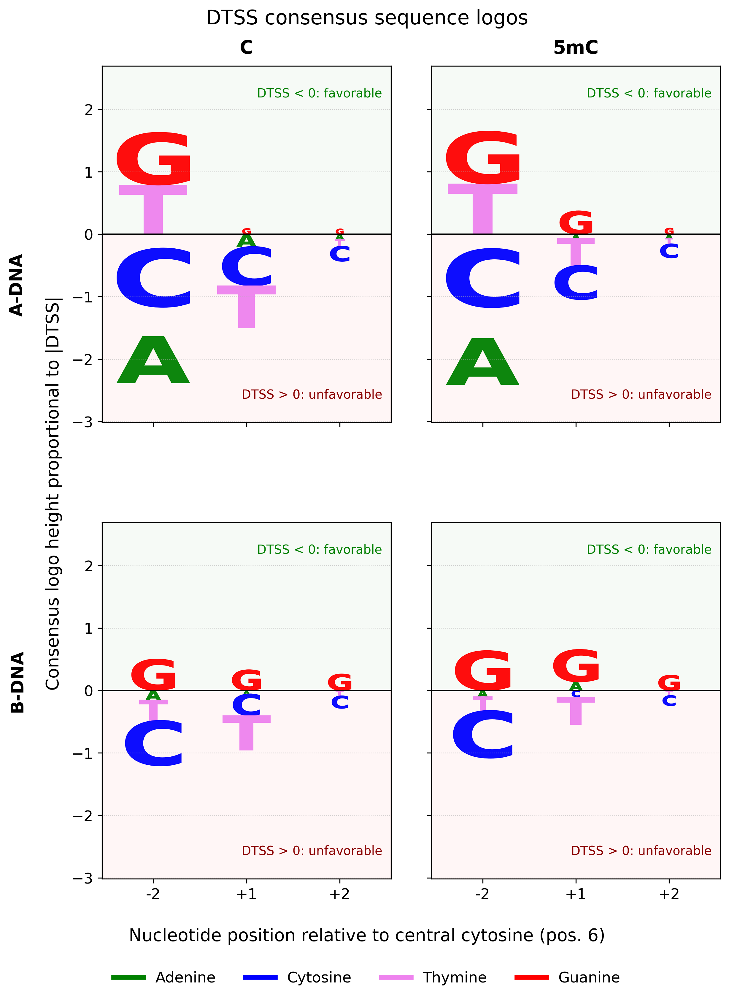
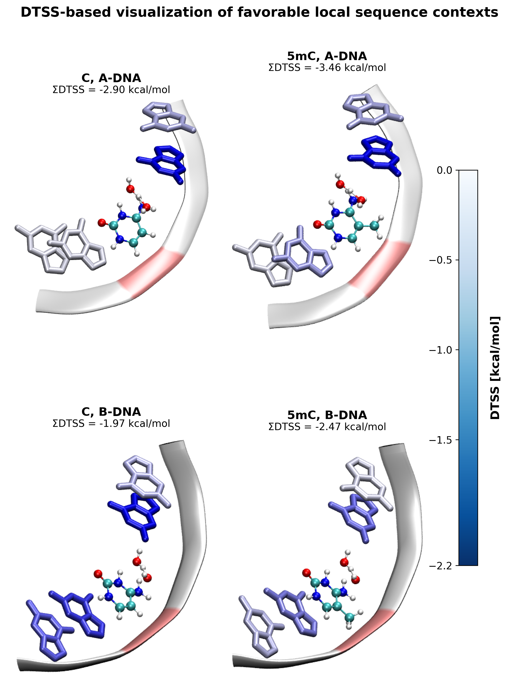

# DNA Sequence Effects on Cytosine Deamination

Computational analysis of the influence of the local nucleotide sequence on the spontaneous deamination of cytosine and 5-methylcytosine in DNA.

[View portfolio page](https://USERNAME.github.io/REPOSITORY_NAME/)  
[Read the master's thesis](thesis.pdf)  
[Open the analysis notebook](notebooks/deamination_analysis.ipynb)

[](https://colab.research.google.com/github/USERNAME/REPOSITORY_NAME/blob/main/notebooks/deamination_analysis.ipynb)

## Project overview

This repository presents the workflow, results and conclusions of my master's thesis:

**Spontaneous deamination of cytosine in DNA – modelling the impact of nucleotide sequence**

The project investigated how neighboring nucleotides influence the interaction energy and differential transition-state stabilization during the deamination of cytosine and 5-methylcytosine.

The main objective was to identify local nucleotide contexts that preferentially stabilize the transition state relative to the substrate and may therefore energetically favor the deamination process.

The analysis included:

- cytosine and 5-methylcytosine reaction models,
- substrate and transition-state structures,
- A-DNA and B-DNA geometries,
- adenine, cytosine, guanine and thymine as neighboring bases,
- different nucleotide positions relative to the reaction site,
- MED interaction-energy analysis,
- CAMM electrostatic and Das dispersion components,
- differential transition-state stabilization analysis.

## Research question

Does the identity and position of neighboring nucleotides affect the relative stabilization of the substrate and transition state during cytosine and 5-methylcytosine deamination?

A nucleotide was considered energetically favorable when it stabilized the transition state more strongly than the corresponding substrate.

## Computational approach

Substrate and transition-state models for cytosine and 5-methylcytosine deamination were incorporated into predefined A-DNA and B-DNA structural frameworks.

The central reacting cytosine or 5-methylcytosine was defined as position `0`. Neighboring bases were numbered relative to the reaction site:

```text
-5  -4  -3  -2  -1  [C/5mC]  +1  +2  +3  +4  +5
```

Individual positions were analyzed using adenine, cytosine, guanine and thymine variants.

Position `-1` was excluded from the final analysis because the nucleotide produced steric clashes with water molecules included in the substrate and transition-state models. These contacts were treated as structural artifacts rather than meaningful sequence-dependent interactions.

## MED interaction-energy model

The total MED interaction energy was calculated as the sum of the CAMM and Das components:

\[
MED = CAMM + Das
\]

where:

- `CAMM` represents the multipole electrostatic contribution,
- `Das` represents the dispersion contribution.

Negative MED values indicate attractive interactions, whereas positive values indicate unfavorable interactions for a given geometry.

## Differential transition-state stabilization

Differential transition-state stabilization was calculated as:

\[
DTSS = MED_{TS} - MED_{substrate}
\]

where:

- `MED_TS` is the interaction energy between a neighboring nucleotide and the transition-state model,
- `MED_substrate` is the interaction energy between the same nucleotide and the substrate model.

Interpretation:

- `DTSS < 0` indicates preferential stabilization of the transition state and a potentially favorable effect on deamination,
- `DTSS > 0` indicates preferential stabilization of the substrate and a potentially unfavorable effect on deamination,
- values close to zero indicate a weak differential effect.

## Main results

### Local character of sequence effects

The influence of the nucleotide sequence was strongly local.

Positions located farther from the reaction center, particularly `-5`, `-4`, `+4` and `+5`, showed MED and DTSS values close to zero. The largest differences were observed mainly at positions `-2`, `+1` and `+2`.

### MED interaction energies

The strongest attractive MED interactions were observed mainly at position `+1`, directly adjacent to the reaction center.

Thymine at position `+1` produced the most negative MED values in the analyzed substrate and transition-state complexes.

This result describes the overall interaction strength with the reaction model. It does not directly indicate whether a nucleotide favors deamination, because MED alone does not distinguish between stabilization of the substrate and stabilization of the transition state.

### Physical origin of the interactions

The strongest attractive interactions at position `+1` were mainly driven by the Das dispersion component.

This effect is associated with the short distance between the neighboring base and the reacting model, allowing strong dispersion interactions between the aromatic and polarizable molecular fragments.

The CAMM component was more sensitive to nucleotide identity, spatial orientation and charge distribution.

At position `-2`, differences between nucleotide types were controlled to a larger extent by electrostatic interactions. Positive CAMM values weakened or overcame the attractive Das contribution, while negative CAMM values strengthened the total MED interaction.

### DTSS results

Guanine at position `-2` produced the most favorable DTSS values in all four analyzed systems:

- cytosine in A-DNA,
- 5-methylcytosine in A-DNA,
- cytosine in B-DNA,
- 5-methylcytosine in B-DNA.

This means that guanine at position `-2` stabilized the transition state more strongly than the substrate.

In contrast, cytosine at position `-2` produced positive DTSS values and preferentially stabilized the substrate.

### Favorable local sequence context

For positions `-3`, `-2`, `+1` and `+2`, guanine was identified as the most favorable nucleotide in every analyzed system.

The predicted favorable local context was therefore:

```text
(-3)G  (-2)G  [C/5mC]  (+1)G  (+2)G
```

The favorable pattern was conserved for cytosine and 5-methylcytosine in both DNA conformations.

However, the magnitude of stabilization differed between systems:

- the DTSS effect was stronger in A-DNA than in B-DNA,
- the effect was slightly stronger for 5-methylcytosine than for cytosine within the same DNA conformation.

These results describe relative energetic tendencies in the analyzed structural models. They should not be interpreted as direct predictions of experimental deamination rates.

## Selected figures

### DNA structural models




### MED interaction-energy heatmaps



### MED interaction-energy profiles



### CAMM and Das components



### DTSS heatmaps



### A-DNA and B-DNA comparison



### Favorable sequence context



## Automated data analysis

The repository contains a Jupyter notebook:

[`notebooks/deamination_analysis.ipynb`](notebooks/deamination_analysis.ipynb)

The notebook provides a reproducible workflow for processing and visualizing the calculated interaction-energy results.

It:

1. reads MED energy components from a CSV file,
2. checks the completeness and consistency of the dataset,
3. verifies whether MED values correspond to the sum of CAMM and Das,
4. calculates DTSS as `MED_TS - MED_substrate`,
5. sorts the data by central base, DNA form, nucleotide position and nucleotide identity,
6. generates MED interaction-energy heatmaps,
7. generates MED interaction-energy profiles,
8. compares CAMM and Das components,
9. generates DTSS heatmaps,
10. identifies the most favorable nucleotide at each position,
11. summarizes the predicted favorable local sequence,
12. exports processed results to CSV files.

The notebook automates the **data processing, DTSS calculation and visualization stage**.

It does not automate the original preparation of molecular structures, GAMESS calculations or generation of the raw CAMM and Das results.

## Repository structure

The repository contains the portfolio website, thesis document, molecular structures, Python scripts, processed data, figures and a Jupyter notebook used for reproducible analysis.

```text
master-thesis/
├── index.html
├── masters.css
├── README.md
├── thesis.pdf
├── requirements.txt
│
├── data/
│   ├── thesis_results.csv
│   ├── thesis_results_with_DTSS.csv
│   └── favorable_nucleotides.csv
│
├── notebooks/
│   └── deamination_analysis.ipynb
│
├── figures/
│   ├── DNA-scheme.png
│   ├── DNA-scheme-ADNA.png
│   ├── MED-heatmap.png
│   ├── DTSS-heatmap.png
│   ├── MED-profile.png
│   ├── CAMM-Das-comparison.png
│   ├── ADNA-BDNA-comparison.png
│   ├── favorable-sequence-context.png
│   ├── ADNA_5mC_S_pos(-1)_G.png
│   ├── BDNA_5mC_S_pos(-1)_G.png
│   └── mutation_snapshots/
│
├── structures/
│   ├── C_S_B.pdb
│   ├── C_TS_B.pdb
│   ├── C_S_A.pdb
│   ├── C_TS_A.pdb
│   ├── 5mC_S_B.pdb
│   ├── 5mC_TS_B.pdb
│   ├── 5mC_S_A.pdb
│   └── 5mC_TS_A.pdb
│
└── python/
|   ├── model_preparation/
|   │   ├── 01_mutate_ssdna.py
|   │   ├── 02_generate_all_mutants.py
|   │   └── 03_extract_mutated_bases.py
|   │
|   ├── energy_calculations/
|   │   ├── 04_prepare_gamess_input.py
|   │   ├── 05_calculate_camm.py
|   │   ├── 06_calculate_das.py
|   │   └── external/
|   │       └── das_dispersion_core.py
|   │
|   └── visualization/
|       ├── 07_plot_dtss_heatmaps.py
|       ├── 08_plot_das_camm_components.py
|       └── 09_plot_dtss_sequence_logos.py
|   
└── automated_data_analysis/
      ├── deamination_analysis.ipynb
      └── deamination_results.csv
 ```

## Directory description

- `index.html` contains the main portfolio page presenting the project.
- `masters.css` contains the styling used by the portfolio page.
- `thesis.pdf` contains the complete master's thesis.
- `data/` contains the MED input results, calculated DTSS values and summaries of favorable nucleotides.
- `notebooks/` contains the reproducible Jupyter notebook used for data validation, DTSS calculation and visualization.
- `figures/` contains plots used on the portfolio page and molecular structure snapshots.
- `structures/` contains representative substrate and transition-state models for cytosine and 5-methylcytosine in A-DNA and B-DNA geometries.
- `python/model_preparation/` contains scripts for nucleotide mutation, generation of sequence variants and extraction of selected nucleobase fragments.
- `python/energy_calculations/` contains scripts related to GAMESS input preparation and calculation of CAMM and Das energy components.
- `python/visualization/` contains scripts used to generate heatmaps, energy-component comparisons and sequence-context visualizations.

## Running the Jupyter notebook

Clone the repository:

```bash
git clone https://github.com/USERNAME/REPOSITORY_NAME.git
cd REPOSITORY_NAME
```

Install the required Python packages:

```bash
pip install -r requirements.txt
```

Start JupyterLab:

```bash
jupyter lab
```

Open:

```text
notebooks/deamination_analysis.ipynb
```

and run all cells.

If the notebook and CSV file are stored in separate folders, the input path inside the notebook should point to:

```python
from pathlib import Path

DATA_PATH = Path("../data/thesis_results.csv")
FIGURES_DIR = Path("../figures")
```

## Opening the notebook in Google Colab

The notebook can also be opened directly in Google Colab using the badge at the beginning of this README.

When running the notebook in Colab, clone the repository first:

```python
!git clone https://github.com/USERNAME/REPOSITORY_NAME.git
%cd REPOSITORY_NAME/notebooks
```

The CSV file can then be accessed using:

```python
from pathlib import Path

DATA_PATH = Path("../data/thesis_results.csv")
```

Changes made during a Colab session are not automatically saved back to GitHub.

## Python requirements

The data-analysis notebook uses:

- Python 3,
- pandas,
- numpy,
- matplotlib,
- JupyterLab.

Optional plotting scripts may additionally use:

- seaborn.

Example `requirements.txt`:

```text
pandas
numpy
matplotlib
seaborn
jupyterlab
```

## External software used in the original workflow

The original computational workflow additionally involved external molecular-modelling and quantum-chemistry software.

### PyMOL

PyMOL was used for:

- molecular structure inspection,
- nucleotide mutation,
- preparation of single-nucleotide variants,
- extraction of selected nucleobase fragments,
- visual verification of structural models.

### GAMESS

GAMESS was used to generate quantum-chemical output required for the CAMM electrostatic analysis.

### Open Babel

Open Babel was used for molecular file-format conversion, particularly during preparation of GAMESS input files.

### pymolecule

The `pymolecule` module was used for reading molecular multipole data from GAMESS output and calculating CAMM interaction energies.

### Das dispersion scripts

Dedicated Python scripts were used to calculate the Das dispersion component of the MED interaction energy.

These external tools are not required to open the final notebook or reproduce the DTSS analysis from the processed CSV file.

## Limitations

The analysis was performed using predefined A-DNA and B-DNA structural frameworks rather than extensive conformational sampling of dynamic DNA structures.

The calculated DTSS values describe differences in electronic interaction energies. They do not include all contributions that may affect experimental deamination rates, including:

- conformational entropy,
- extensive solvent sampling,
- DNA dynamics,
- complete free-energy contributions,
- accessibility of reactive conformations,
- DNA repair efficiency.

The MED model also simplifies the physical description of intermolecular interactions by focusing on multipole electrostatics and dispersion.

The results should therefore be interpreted as relative energetic preferences between closely related nucleotide variants rather than absolute kinetic predictions.

## Master's thesis

**Title:** Spontaneous deamination of cytosine in DNA – modelling the impact of nucleotide sequence

**Polish title:** Spontaniczna deaminacja cytozyny w DNA – modelowanie wpływu sekwencji nukleotydowej

**Author:** Gabriela Bieda

**Degree:** Master of Science in Bioinformatics

**University:** Wrocław University of Science and Technology

**Supervisor:** Dr Edyta Dyguda-Kazimierowicz

## Author

**Gabriela Bieda**

MSc graduate in Bioinformatics with experience in computational biology, molecular modelling, quantum-chemical data analysis and Python-based scientific workflows.
