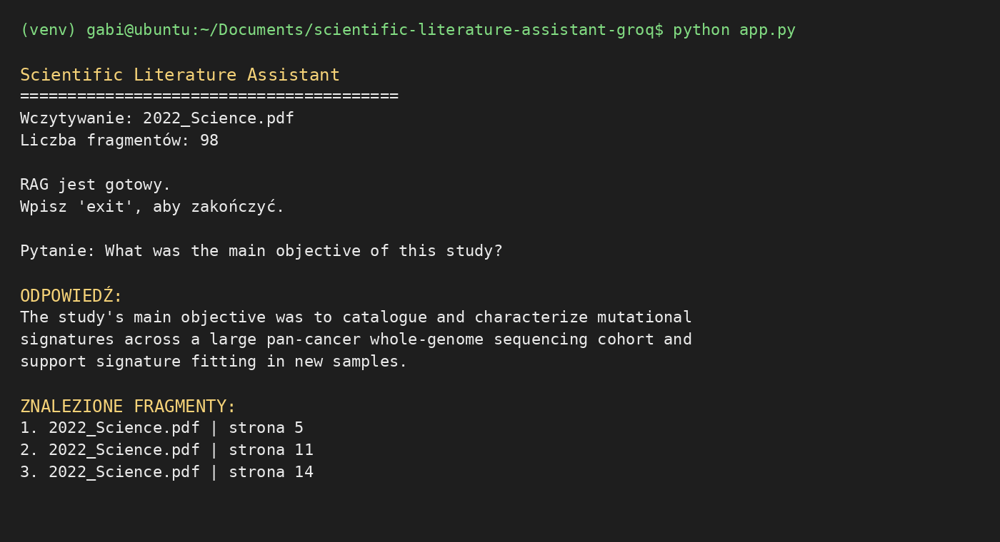
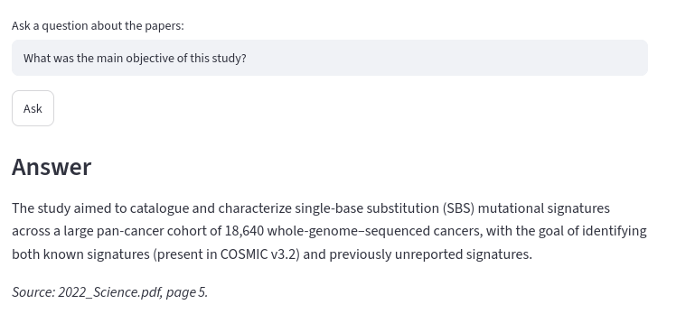
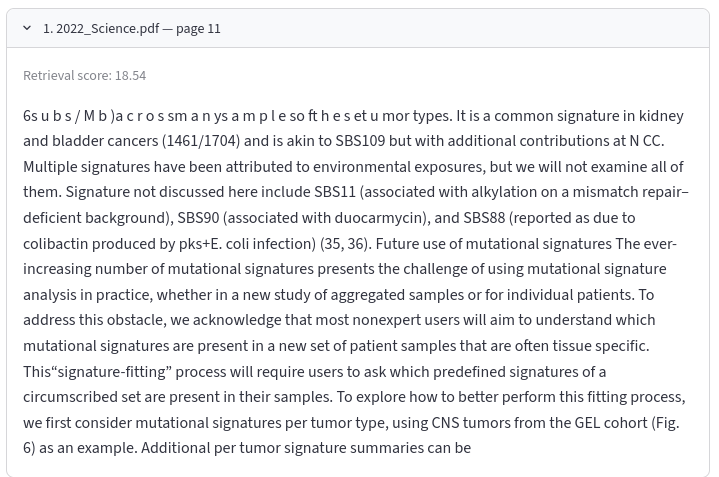

# Scientific Literature Assistant

A lightweight Retrieval-Augmented Generation (RAG) prototype for asking questions about scientific PDF papers.

The project was designed to remain small enough to run in a Linux environment with limited storage. Instead of local embedding models, PyTorch, or FAISS, it uses **BM25Plus** for lexical retrieval and **Groq** for semantic reranking and answer generation.

The current implementation supports both a simple terminal workflow (`app.py`) and a Streamlit interface (`streamlit_app.py`).

## Project goals

The main goals of the project were to:

- extract text from scientific PDF files,
- split papers into overlapping text chunks,
- retrieve passages relevant to a user question,
- improve lexical BM25 results with an LLM reranking step,
- generate answers grounded in the retrieved passages,
- attach citations at the page level to factual claims,
- expose the retrieval process so users can inspect the evidence used by the model.

## Repository structure

```text
scientific-literature-assistant-groq/
├── app.py
├── streamlit_app.py
├── check_setup.py
├── requirements.txt
├── .env.example
├── .gitignore
├── README.md
│
├── src/
├── data/
│   └── papers/
│
└── docs/
    └── screenshots/
        ├── terminal_app.png
        ├── streamlit_answer.png
        └── streamlit_source.png
```

### Main files

| File | Purpose |
|---|---|
| `app.py` | Lightweight terminal version of the literature assistant. Useful for quick testing without a browser interface. |
| `streamlit_app.py` | Main web application. Includes PDF parsing, chunking, BM25Plus retrieval, filtering, Groq reranking, answer generation, and citations. |
| `check_setup.py` | Optional setup checker for the API key, PDF directory, installed packages, and available papers. |
| `requirements.txt` | Minimal Python dependencies required by the project. |
| `.env.example` | Example environment file showing how to configure `GROQ_API_KEY`. |
| `data/papers/` | Local directory for scientific PDFs. PDF files should not be committed to GitHub. |
| `docs/screenshots/` | Screenshots used in this README. |

The project does **not** require `vector_store/`, FAISS, Sentence Transformers, PyTorch, or a separate ingestion pipeline in its current form. The BM25 index is built in memory when the application starts.

## How the RAG pipeline works

```text
Scientific PDF files
        |
        v
      pypdf
        |
        v
Text normalization
        |
        v
Overlapping chunks
220 words / 60-word overlap
        |
        v
Tokenization + query expansion
        |
        v
     BM25Plus
        |
        v
30 initial candidates
        |
        v
Local filtering and reranking
  - bibliography filtering
  - duplicate filtering
  - keyword coverage
  - bigram overlap
        |
        v
10 candidate passages
        |
        v
   Groq reranker
        |
        v
4 strongest evidence passages
        |
        v
Groq answer generation
        |
        v
Answer + page-level citations
```

## Why BM25Plus?

The first version of the project was planned around dense embeddings and FAISS. That approach requires larger dependencies such as `sentence-transformers` and usually PyTorch.

For this prototype, BM25Plus was selected because it:

- has a small installation footprint,
- does not require a GPU,
- does not require downloading an embedding model,
- works well for scientific terminology and exact phrases,
- makes the retrieval process easy to inspect.

The limitation is that BM25 is primarily lexical. It does not inherently understand that semantically related words may express the same concept. The project partially addresses this through manual query expansion and a Groq-based reranking stage.

## Retrieval improvements implemented

The Streamlit version includes several improvements over a basic BM25 search.

### Text normalization

PDF extraction frequently produces broken text such as:

```text
signa-
tures
```

The preprocessing stage joins split words, removes unnecessary line breaks, and normalizes repeated whitespace before indexing.

### Overlapping chunks

Pages are split into chunks of approximately 220 words with a 60-word overlap. This reduces the chance of losing information that occurs at a chunk boundary.

### Query expansion

Common scientific question terms are expanded with related expressions. For example:

```text
objective -> aim, aimed, goal, purpose, sought
methods   -> methodology, analysis, workflow, approach
results   -> finding, findings, observed
```

### Low value passage filtering

The retriever attempts to remove passages dominated by:

- bibliography entries,
- DOI and PMID lists,
- acknowledgements,
- funding statements.

### Duplicate filtering

Highly similar overlapping chunks are detected with Jaccard similarity and removed from the candidate set.

### Groq semantic reranking

BM25Plus first retrieves a larger candidate set. Groq then evaluates the passages in relation to the actual question and selects the four most useful pieces of evidence.

This helps correct cases where a passage contains many matching keywords but is not the best evidence for answering the question.

## Citation strategy

The answer generator receives only the passages selected by the retrieval pipeline.

Each passage contains:

```text
SOURCE: 2022_Science.pdf
PAGE: 11
ALLOWED CITATION: [2022_Science.pdf, p. 11]
```

The generation prompt instructs the model to:

- use only retrieved evidence,
- avoid unsupported outside knowledge,
- cite factual claims immediately after the relevant sentence,
- use only filenames and page numbers present in the retrieved context,
- separate claims when they originate from different pages,
- return a clear "not found" response when the evidence is insufficient.

Example:

```text
The study catalogued known and previously unreported mutational
signatures across a large whole-genome cancer cohort
[2022_Science.pdf, p. 5].

The authors also developed FitMS to identify common organ-specific
signatures before testing for additional rare signatures
[2022_Science.pdf, p. 11].
```

## Screenshots

### Terminal version (`app.py`)

The terminal implementation provides a minimal interface for loading the papers, asking a question, and inspecting the retrieved fragments.



### Streamlit interface

The Streamlit version provides a browser-based interface for asking questions about papers.



Retrieved passages can be expanded and inspected directly in the interface.



## Installation

### Requirements

Recommended environment:

- Python 3.11
- Linux, macOS, or Windows
- Groq API key

Minimal dependencies:

```text
pypdf
rank-bm25
groq
python-dotenv
streamlit
```

### Option 1: create the environment with `uv`

This is useful when Python 3.11 is not installed system-wide.

```bash
uv venv --python 3.11 venv
source venv/bin/activate
uv pip install -r requirements.txt
```

### Option 2: standard Python virtual environment

If Python 3.11 is already installed:

```bash
python3.11 -m venv venv
source venv/bin/activate
pip install -r requirements.txt
```

## Groq API configuration

Create a local `.env` file in the project root:

```text
GROQ_API_KEY=your_groq_api_key_here
```

## Add scientific papers

Place one or more PDF files in:

```text
data/papers/
```

For example:

```text
data/papers/example_paper.pdf
```
## Run the terminal application

```bash
source venv/bin/activate
python app.py
```

Example question:

```text
What was the main objective of this study?
```

Exit with:

```text
exit
```

## Run the Streamlit application

```bash
source venv/bin/activate
streamlit run streamlit_app.py
```

Open the local address displayed in the terminal, usually:

```text
http://localhost:8501
```

## Example questions

```text
What was the main objective of this study?
```

```text
What methods were used in this study?
```

```text
What were the main conclusions of this study?
```

```text
What conclusions did the authors draw from their results?
```

A useful control question is one whose answer is not present in the document. This helps test whether the model avoids inventing information that is not supported by the source.

## Current quality assessment

The current system should be treated as a **working research prototype**

Manual testing on a scientific paper showed several encouraging behaviors.

| Test | Observed behavior | Current assessment |
|---|---|---|
| Main objective | Retrieved passages describing the study scope and signature-fitting goal; Groq reranking improved the ordering relative to raw BM25. | Good |
| Methods | Retrieved workflow and methodology passages from multiple pages. | Good |
| Source attribution | Generated page-level citations that matched the retrieved evidence in tested examples. | Good |
| Main conclusions | Retrieved the explicit conclusion section and relevant discussion passages, but the generated answer sometimes included detailed individual findings instead of only the highest-level conclusions. | Needs refinement |
| Retrieval transparency | Users can inspect both final passages and BM25 candidates before Groq reranking. | Strong |

### What the current prototype does well

- It is lightweight and can run without local language or embedding models.
- Retrieval is transparent rather than hidden behind an opaque vector database.
- Groq reranking improves some cases where BM25 keyword ranking is misleading.
- Answers are grounded in retrieved passages rather than generated from the full model knowledge base.
- Page-level citations make it possible to manually verify the answer against the paper.
- The application exposes retrieval scores and retrieved text for debugging.

### Current limitations

The quality evaluation above is based on manual testing, not a formal benchmark.

Important limitations include:

1. **BM25 is lexical.** A relevant passage may be missed when the question and paper use different terminology.
2. **Query expansion is manually defined.** It covers only a small set of common question types.
3. **PDF extraction can be noisy.** Figures, multi-column layouts, mathematical notation, and letter spacing can produce malformed text.
4. **Section awareness is limited.** The retriever does not yet explicitly recognize Abstract, Methods, Results, Discussion, and Conclusion sections.
5. **Conclusion questions can be too broad.** The model may mix central conclusions with detailed results if both appear in the final evidence set.
6. **Citation correctness is prompt-driven.** The model is instructed to use only allowed citations, but there is not yet a deterministic post-generation citation verifier.
7. **Groq is called twice per question.** One call is used for reranking and another for answer generation, which increases API usage and latency.
8. **The BM25 index is rebuilt on application startup.** This is simple for small collections but becomes less efficient as the document library grows.
9. **Scanned PDFs are not supported unless they already contain extractable text.** There is currently no OCR stage.

## Potential improvements

### 1. Section-aware retrieval

Detect section headings such as:

```text
Abstract
Methods
Results
Discussion
Conclusion
```

The retriever could then favor the Conclusion section for conclusion questions and Methods for methodology questions.

### 2. Programmatic citation validation

Instead of relying only on the prompt, return structured output from Groq and verify that every cited page exists in the selected context before rendering the answer.

### 3. Better passage diversity

Introduce stronger diversity constraints so that final evidence does not contain multiple fragments from the same page unless they provide clearly different information.

### 4. Hybrid lexical + semantic retrieval

A future version could combine:

```text
BM25Plus
+
semantic embeddings
+
LLM reranking
```

This would improve recall for questions that use different terminology from the paper. It would, however, increase storage and dependency requirements.

### 5. Improved PDF parsing

A layout-aware parser could better handle:

- multi-column papers,
- tables,
- figure captions,
- equations,
- headers and footers.

### 6. Automatic query rewriting

Groq could first rewrite the user question into several retrieval-focused search queries before BM25 search.

### 7. Formal evaluation

A small evaluation dataset could be created with manually verified questions, answers, pages, and relevant passages.

Useful metrics could include:

- Recall@k for retrieval,
- Mean Reciprocal Rank (MRR),
- citation precision,
- citation recall,
- answer faithfulness,
- unsupported-claim rate.

### 8. Persistent document indexing

For larger collections, preprocessing and BM25 indexing could be moved into a separate ingestion stage and saved to disk rather than rebuilt on every startup.

## Development status

The project currently demonstrates a complete lightweight RAG workflow:

```text
PDF parsing -> chunking -> BM25Plus retrieval -> filtering -> Groq reranking
-> evidence-grounded answer generation -> page-level citations -> Streamlit UI
```

## Future direction

The next major development step would be to compare the current lightweight BM25Plus pipeline against a hybrid semantic retrieval approach on a small manually annotated benchmark. This would make it possible to measure whether the additional computational cost of embeddings produces a meaningful improvement in scientific question answering.

